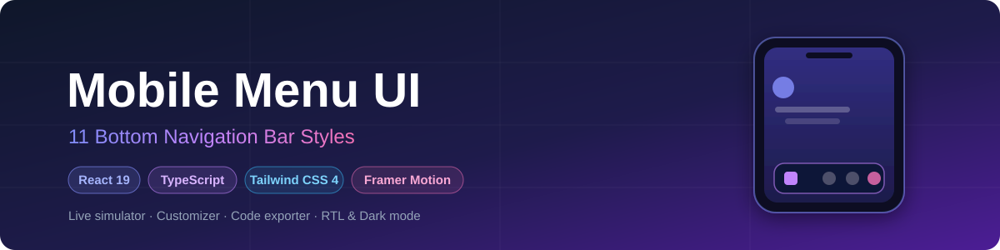

<div align="center">



# Mobile Menu UI

**A production-ready collection of 11 mobile bottom navigation bar styles.**
Built with React 19, TypeScript, Tailwind CSS 4 and Framer Motion.

[](https://duorampant.github.io/mobile-menu-ui/)
[](LICENSE)

[](https://github.com/DuoRampant/mobile-menu-ui/stargazers)
[](https://github.com/DuoRampant/mobile-menu-ui/network/members)
[](https://github.com/DuoRampant/mobile-menu-ui/watchers)
[](https://github.com/DuoRampant/mobile-menu-ui/issues)
[](https://github.com/DuoRampant/mobile-menu-ui/pulls)
[](https://github.com/DuoRampant/mobile-menu-ui)

</div>

---

Preview every style in an interactive phone simulator, customize tabs, icons, badges and colors, then export clean copy-paste code for your own project.

## Features

- **11 distinct menu styles** — minimal, glassmorphism, floating, neumorphism, pill highlight, center FAB, gradient, outline, sliding indicator, curved notch, and iOS-style dock.
- **Live phone simulator** with four wallpaper options and animated screen transitions (Framer Motion).
- **Customizer** — reorder-free tab editing: rename labels, pick icons, add badges, choose accent themes (7 palettes), toggle labels and RTL layout.
- **RTL support** — every menu style fully supports right-to-left layouts using logical CSS properties.
- **Dark mode** — class-based dark theme toggle across the entire studio.
- **Code exporter** — generates a self-contained React + TypeScript + Framer Motion component or plain Tailwind HTML markup from your current configuration.
- **Preset library** — save configurations to Supabase and load them back with one click.

## Live Demo

> The studio is deployed on GitHub Pages:
>
> **[https://duorampant.github.io/mobile-menu-ui/](https://duorampant.github.io/mobile-menu-ui/)**

## Tech Stack

| Layer      | Tools                                                        |
| ---------- | ------------------------------------------------------------ |
| Frontend   | React 19, TypeScript, Vite 7, Tailwind CSS 4                 |
| Animation  | Framer Motion                                                |
| Icons      | Lucide React                                                 |
| Backend    | Vercel serverless functions (`api/`)                         |
| Database   | Supabase (PostgreSQL)                                        |

## Getting Started

### Prerequisites

- Node.js 20+
- A Supabase project (for the preset library; the UI works without it)

### Install & run

```bash
git clone https://github.com/DuoRampant/mobile-menu-ui.git
cd mobile-menu-ui
npm install
npm run dev
```

The studio opens at `http://localhost:5173`.

### Environment variables

Copy `.env.example` to `.env` and fill in the values:

| Variable                    | Scope    | Description                                              |
| --------------------------- | -------- | -------------------------------------------------------- |
| `SUPABASE_URL`              | server   | Your Supabase project URL                                |
| `SUPABASE_SERVICE_ROLE_KEY` | server   | Service role key — server-side only, never commit        |
| `API_ADMIN_TOKEN`           | server   | Required header value for update/delete endpoints        |
| `ALLOWED_ORIGIN`            | optional | Restricts CORS to your deployed origin (defaults to `*`) |

> Server variables are read by the Vercel functions at runtime — set them in your hosting dashboard for production deployments.

### Database setup

Run the migration to enable atomic like counters:

```sql
-- supabase/migrations/0001_increment_likes.sql
```

Execute it in the Supabase SQL editor, or via the Supabase CLI.

## Scripts

| Command           | Description                         |
| ----------------- | ----------------------------------- |
| `npm run dev`     | Start the development server        |
| `npm run build`   | Type-check and build for production |
| `npm run lint`    | Lint the codebase                   |
| `npm run preview` | Preview the production build        |

## Deployment (GitHub Pages)

The site is published from the `gh-pages` branch to GitHub Pages:

1. Build with `npm run build` (the Vite `base` is already set for the project page path).
2. Push the contents of `dist/` to the `gh-pages` branch.
3. GitHub Pages serves it at `https://duorampant.github.io/mobile-menu-ui/`.

## Project Structure

```
├── api/                     # Vercel serverless functions
│   ├── db-client.js         # Supabase client factory (service role)
│   └── menu-presets.js      # Preset CRUD + likes endpoint
├── docs/                    # Repository assets (banner)
├── src/
│   ├── components/
│   │   ├── MenuStyles/      # The 11 navigation bar implementations
│   │   ├── PhoneSimulator   # Interactive device preview
│   │   ├── MenuCustomizer   # Tab/icon/badge/theme editor
│   │   ├── CodeExporter     # Config → code generator
│   │   └── PresetLibrary    # Saved configuration browser
│   ├── lib/themes.ts        # Accent color token definitions
│   ├── types/menu.ts        # Shared types & style metadata
│   └── index.css            # Tailwind entry + dark mode variant
└── supabase/migrations/     # Database migrations
```

## Security Notes

- All mutating API operations are validated server-side (enum checks, length limits, item shape).
- Update and delete endpoints require the `X-Admin-Token` header matching `API_ADMIN_TOKEN`.
- Likes use an atomic database function to prevent race conditions.
- Search input is sanitized before being passed to PostgREST filters.
- Never commit real credentials — configure them through environment variables.

## Contributing

Bug reports and feature requests are welcome — please use the [issue templates](.github/ISSUE_TEMPLATE):

1. Fork the repository and create your branch from `main`.
2. Run `npm run lint` and `npm run build` before opening a pull request.
3. Keep changes focused and describe the motivation clearly.

## License

Released under the [MIT License](LICENSE) © [DuoRampant](https://github.com/DuoRampant).

<div align="center">

If this project helps you, consider giving it a **star**.

</div>
